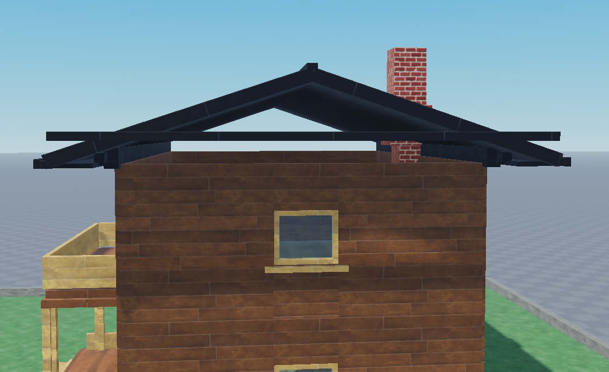
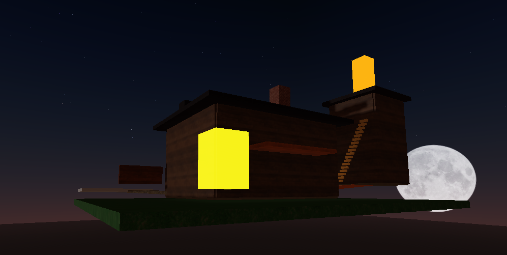
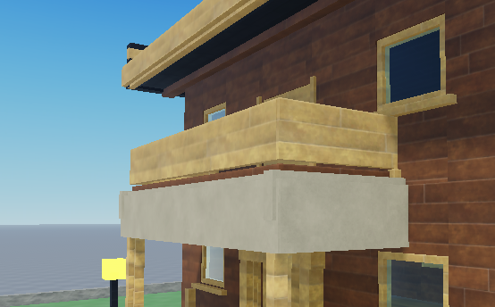
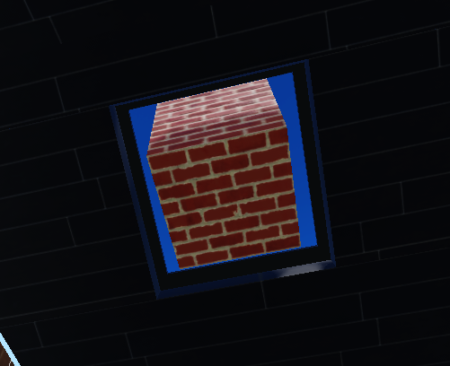
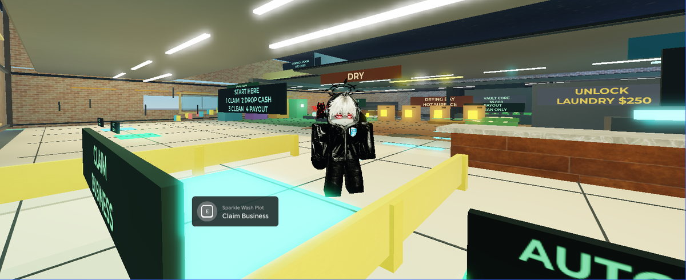
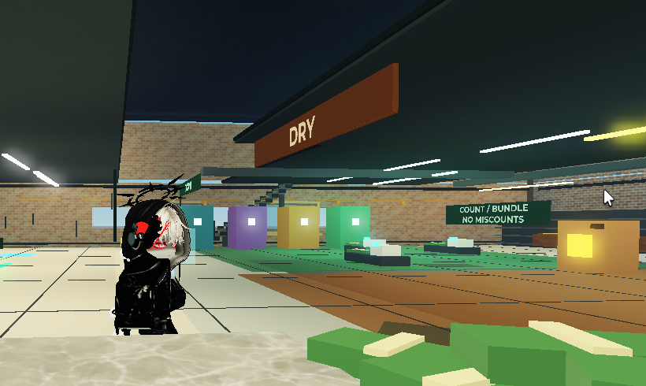

# Skills

`roblox-studio` connects Claude Code, Codex, Cursor, Gemini CLI, and other coding agents to the place open in Roblox Studio.

The agent can inspect the hierarchy, draft a SceneSpec, create terrain and geometry, write scoped Luau, patch generated instances, mirror code to Rojo, validate the map, and coordinate playtests. Studio changes use Undo recording and new builds stay under `Workspace/MapDrafts`.

```text
Prompt -> inspect -> SceneSpec -> dry run -> apply -> validate -> playtest
```



## Install

### Claude Code

The marketplace plugin includes the skill and starts the local MCP server:

```text
/plugin marketplace add ShiroKSH/skills
/plugin install roblox-studio@skills
```

### Codex

```sh
npx skills add ShiroKSH/skills -g
codex mcp add roblox-studio -- npx -y github:ShiroKSH/skills
```

Restart Codex after adding the MCP server.

### Cursor, Copilot, Gemini CLI, and other hosts

Install the skill:

```sh
npx skills add ShiroKSH/skills -g
```

Add the bridge as a stdio MCP server:

```json
{
  "mcpServers": {
    "roblox-studio": {
      "command": "npx",
      "args": ["-y", "github:ShiroKSH/skills"]
    }
  }
}
```

Requirements: Node.js 20 or newer and Roblox Studio.

## Install the Studio plugin

Clone the repository and run the installer:

```sh
git clone https://github.com/ShiroKSH/skills.git
cd skills
npm install
npm run install:plugin
```

The command builds `dist/RobloxStudioBridge.rbxm` with Rojo and copies it into the local Roblox plugins directory on Windows or macOS. The project pins Rojo in `rokit.toml`.

Manual fallback: run `npm run build:plugin`, then copy the `.rbxm` file into `%LOCALAPPDATA%\Roblox\Plugins` on Windows or `~/Documents/Roblox/Plugins` on macOS.

## Connect Studio

1. Enable HTTP requests for the place.
2. Open the `Roblox Studio Bridge` plugin panel.
3. Keep host `127.0.0.1` and port `3765`.
4. Paste the token printed by the MCP server and select `Connect`.
5. Run `studio_ping` from the agent.

The token is generated locally, is never a Roblox credential, is not persisted by the plugin, and is cleared from the panel after connection. Set `ROBLOX_STUDIO_BRIDGE_TOKEN` only when a stable local token is needed.

## What the bridge exposes

- Bounded hierarchy and property inspection.
- SceneSpec map builds and graybox passes.
- Terrain generation through Studio APIs.
- Batched create, set, ensure, and delete operations inside managed roots.
- Camera control and viewport raycast probes for visual checks.
- Doors, buttons, elevators, teleporters, checkpoints, and scoped runtime scripts.
- Geometry validation, map-readiness contracts, playtest requests, and Studio output.
- Rojo projects under `generated/rojo/<mapName>` when `codegen.target` is `rojo` or `both`.

The full MCP tool list and protocol are documented in [docs/protocol.md](docs/protocol.md). SceneSpec fields are defined in [docs/scene-spec.schema.json](docs/scene-spec.schema.json).

## Map workflow

1. Run `studio_ping` and inspect the relevant place hierarchy.
2. Build a SceneSpec rooted at `Workspace/MapDrafts`.
3. Run `map_apply_scene_spec` with `dryRun=true`.
4. Review the target root, object count, touched services, scripts, filesystem writes, terrain, and risks.
5. Apply with `dryRun=false`.
6. Run `map_validate` on the returned map root with strict geometry enabled.
7. Run `map_readiness_check` for playable builds.
8. Inspect several camera angles, playtest interactions, read Studio output, and patch concrete failures.

Start with [examples/simple-obby.scene.json](examples/simple-obby.scene.json) for a minimal spec or [examples/vertical-bazaar.scene.json](examples/vertical-bazaar.scene.json) for a layered map. Every apply writes a filesystem manifest under `logs/manifests/` and a `SceneManifest` value under the generated map root.

## Build evolution

These are cropped Roblox viewport frames from real iterations. Desktop chrome, chats, usernames, paths, tokens, and unrelated files are excluded.

| V1 first pass | V4 exterior pass |
| --- | --- |
|  |  |

| V4 balcony | V4 window and chimney |
| --- | --- |
|  |  |

## Safety

- The HTTP bridge binds to loopback only; the Studio plugin rejects non-loopback hosts.
- Every plugin endpoint except minimal health status requires the shared token.
- Poll credentials are sent in a POST body, not a URL.
- Dangerous Luau execution is disabled by default and filtered again in Studio.
- Deletes require `DELETE_MAP_DRAFTS` and remain limited to managed build roots.
- External asset IDs require an explicit allowlist.
- Command logs redact tokens, source, code, cookies, passwords, and confirmation values.
- Studio changes use `ChangeHistoryService` recording with a waypoint fallback.

See [docs/safety.md](docs/safety.md) for the full boundary.

## Final result

The same workflow can move from an early blockout to a connected, interactive Roblox place, then keep repairing it from validation and playtest feedback:

| Latest playtest | Latest station detail |
| --- | --- |
|  |  |

## Development

```sh
npm install
npm run check
npm run validate:skill
npm run build:plugin
```

Pull requests receive automatic reviews from CodeRabbit, Qodo, and Sourcery. GitHub
CodeQL scans JavaScript and TypeScript changes, while Dependabot opens grouped weekly
dependency updates and immediate security-fix PRs. Automated suggestions still need
to be verified against the tests and the Roblox Studio safety boundaries.

More detail: [Contributing](CONTRIBUTING.md), [Protocol](docs/protocol.md), [Safety](docs/safety.md), [Troubleshooting](docs/troubleshooting.md), and [Changelog](CHANGELOG.md).
